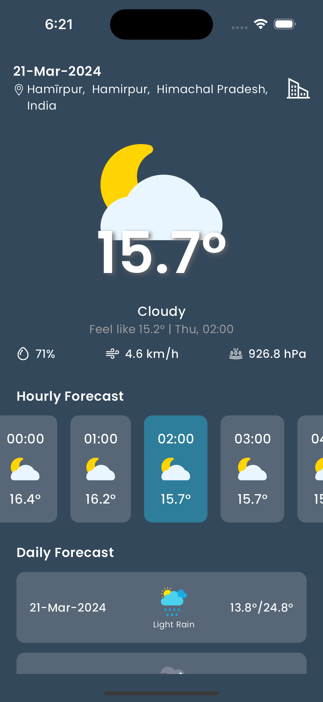
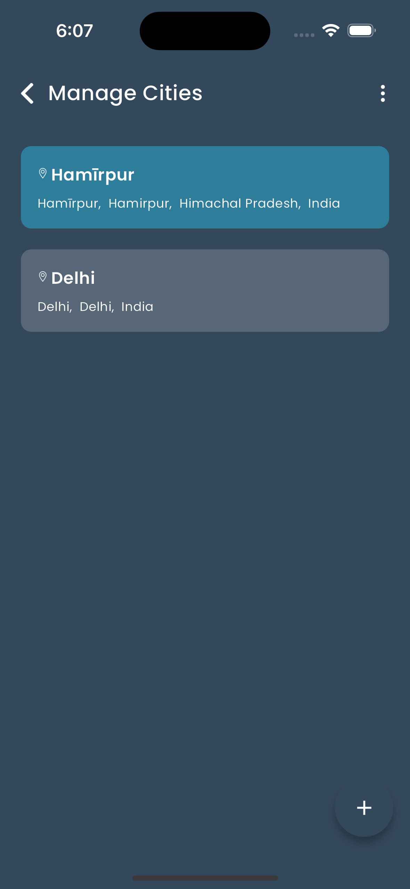
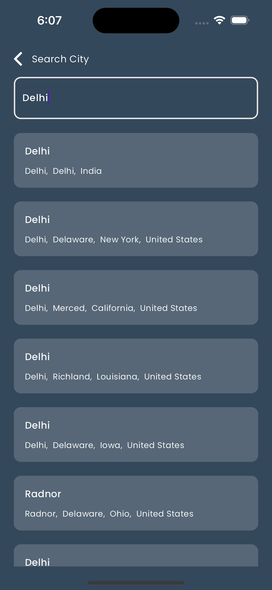
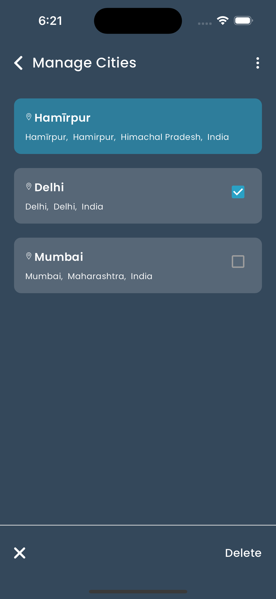

# Weather App

This Flutter application provides users with real-time weather information for their specified locations. With features like weather forecasting by the hour and weekly, detailed weather statistics, and city management, users can stay informed about weather conditions wherever they are.

## Modules

- **Weather Forecast**: Provides users with real-time weather conditions, hourly forecasts, and weekly forecasts.
- **Manage Cities**: Allows users to add or remove cities to customize their weather updates.

## Features

- Real-time weather updates for the user's current location.
- Hourly and weekly weather forecasts.
- Detailed weather statistics including temperature, humidity, wind speed, etc.
- City management functionality to add or remove cities for weather updates.

## Technology Stack

1. **Flutter**: Cross-platform framework for building mobile applications.
2. **Bloc Pattern**: State management architecture for Flutter applications.

## Acknowledgments

1. **Flutter**: [Flutter](https://flutter.dev/).
2. **Bloc Pattern**: [Bloc Pattern](https://bloclibrary.dev/).
2. **Open-Meteo API**: [Open-Meteo API](https://open-meteo.com/).

You can download the apk from the [link](https://drive.google.com/file/d/1cdPc5zr7hy7TLTW1wgiNFrhO07543x7B/view?usp=sharing)

## Screen shots
   
